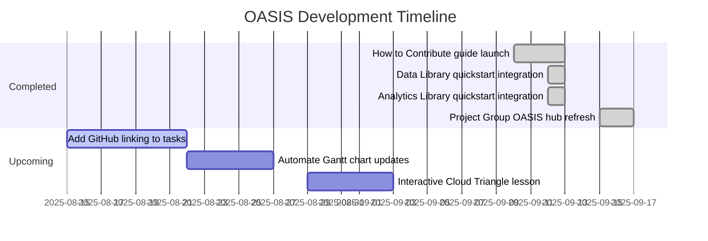

# Development Schedule

A collaborative timeline for OASIS development. Update this page through pull requests and link to contributions as tasks are completed.

Use `python scripts/add_task.py "Task title" ISSUE --duration DAYS` to append work items. The Gantt chart refreshes automatically on pushes and pull requests.

See [Development Requests](dev-requests.md) for external requests made of the team.

Since February 2025, OASIS has grown from an initial scaffold into a tagged documentation site. Late August 2025 added sidebar tag pages, fixed tag links, and launched the Cloud Triangle lesson with examples. Early September 2025 expanded the ecosystem with the [How to Contribute guide](https://cu-esiil.github.io/how_to_contribute/), new quickstarts pointing to the [Data Library](https://cu-esiil.github.io/data-library/) and [Analytics Library](https://cu-esiil.github.io/analytics-library/), and a refreshed [Project Group OASIS hub](https://cu-esiil.github.io/Project_group_OASIS/). Our next steps are to link tasks directly to GitHub issues and automate Gantt chart updates so the roadmap stays current.

## Historical Task List

- [x] [Initial repository setup](https://github.com/CU-ESIIL/home/commit/323aea0) — 2025-02-05
- [x] [Tag-based navigation](https://github.com/CU-ESIIL/home/pull/29) — 2025-08-13
- [x] [Static tag system](https://github.com/CU-ESIIL/home/pull/32) — 2025-08-14
- [x] [Repository structure docs](https://github.com/CU-ESIIL/home/pull/34) — 2025-08-14
- [x] [Development schedule page](https://github.com/CU-ESIIL/home/pull/35) — 2025-08-14

- [x] [Sidebar tag pages](https://github.com/CU-ESIIL/home/pull/55) — 2025-08-19
- [x] [Fix tag links in sidebar](https://github.com/CU-ESIIL/home/pull/56) — 2025-08-19
- [x] [Cloud Triangle scaffold](https://github.com/CU-ESIIL/home/pull/57) — 2025-08-22
- [x] [Cloud Triangle overview](https://github.com/CU-ESIIL/home/pull/58) — 2025-08-22
- [x] [Cloud Triangle examples & figure](https://github.com/CU-ESIIL/home/pull/59) — 2025-08-22
- [x] [How to Contribute guide launch](https://cu-esiil.github.io/how_to_contribute/) — 2025-09-12
- [x] [Data Library quickstart integration](https://github.com/CU-ESIIL/home/commit/e2d76a5) — 2025-09-12
- [x] [Analytics Library quickstart integration](https://github.com/CU-ESIIL/home/commit/f69d9da) — 2025-09-12
- [x] [Project Group OASIS hub refresh](https://cu-esiil.github.io/Project_group_OASIS/) — 2025-09-16

## Upcoming Task List

<!-- upcoming-start -->
- [ ] [Add GitHub linking to tasks](https://github.com/CU-ESIIL/home/issues/60)
- [ ] [Automate Gantt chart updates](https://github.com/CU-ESIIL/home/issues/61)
- [ ] [Interactive Cloud Triangle lesson](https://github.com/CU-ESIIL/home/issues/62)
<!-- upcoming-end -->

## Timeline Overview

| Task | Start | End | Contributors |
|------|-------|-----|--------------|
| Initial repository setup | 2025-02-05 | 2025-02-05 | [Ty Tuff](https://github.com/tytuff) |
| Tag-based navigation | 2025-08-13 | 2025-08-13 | [Ty Tuff](https://github.com/tytuff) |
| Static tag system | 2025-08-14 | 2025-08-14 | [Ty Tuff](https://github.com/tytuff) |
| Repository structure docs | 2025-08-14 | 2025-08-14 | [Ty Tuff](https://github.com/tytuff) |
| Development schedule page | 2025-08-14 | 2025-08-14 | [Ty Tuff](https://github.com/tytuff) |
| Sidebar tag pages | 2025-08-19 | 2025-08-19 | [Ty Tuff](https://github.com/tytuff) |
| Fix tag links in sidebar | 2025-08-19 | 2025-08-19 | [Ty Tuff](https://github.com/tytuff) |
| Cloud Triangle scaffold | 2025-08-22 | 2025-08-22 | [Ty Tuff](https://github.com/tytuff) |
| Cloud Triangle overview | 2025-08-22 | 2025-08-22 | [Ty Tuff](https://github.com/tytuff) |
| Cloud Triangle examples & figure | 2025-08-22 | 2025-08-22 | [Ty Tuff](https://github.com/tytuff) |
| Add GitHub linking to tasks | 2025-08-15 | 2025-08-21 | TBD |
| Automate Gantt chart updates | 2025-08-22 | 2025-08-26 | TBD |
| How to Contribute guide launch | 2025-09-10 | 2025-09-12 | OASIS Team |
| Data Library quickstart integration | 2025-09-12 | 2025-09-12 | [Ty Tuff](https://github.com/tytuff) |
| Analytics Library quickstart integration | 2025-09-12 | 2025-09-12 | [Ty Tuff](https://github.com/tytuff) |
| Project Group OASIS hub refresh | 2025-09-15 | 2025-09-16 | OASIS Team |

## Gantt Chart

