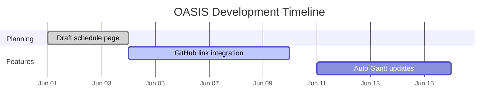

# Development Schedule

A collaborative timeline for OASIS development. Update this page through pull requests and link to contributions as tasks are completed.

## Task List

- [ ] [Draft development schedule page](https://github.com/CU-ESIIL/home/pull/TBD) — [@alice](https://github.com/alice), [@bob](https://github.com/bob)
- [ ] [Add GitHub linking to tasks](https://github.com/CU-ESIIL/home/issues/TBD) — [@carol](https://github.com/carol)
- [ ] [Automate Gantt chart updates](https://github.com/CU-ESIIL/home/issues/TBD) — [@dan](https://github.com/dan)

## Timeline Overview

| Task | Start | End | Contributors |
|------|-------|-----|--------------|
| Draft development schedule page | 2024-06-01 | 2024-06-03 | [@alice](https://github.com/alice), [@bob](https://github.com/bob) |
| Add GitHub linking to tasks | 2024-06-04 | 2024-06-10 | [@carol](https://github.com/carol) |
| Automate Gantt chart updates | 2024-06-11 | 2024-06-16 | [@dan](https://github.com/dan) |

## Gantt Chart

