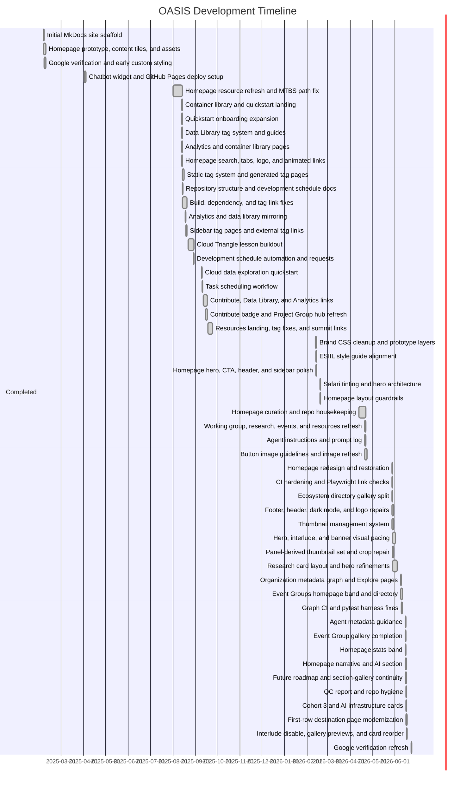
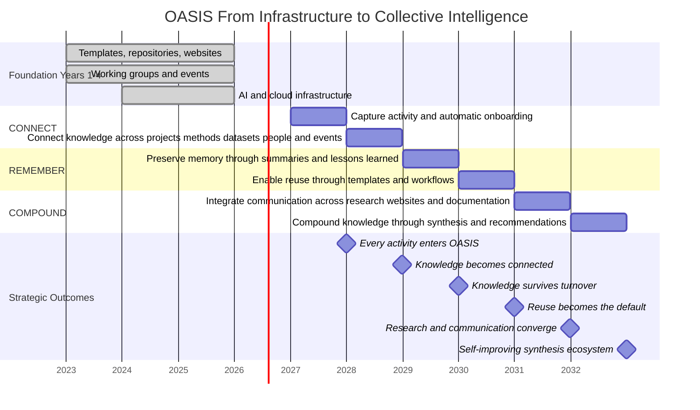

> Archive note: This page documents the 2025 OASIS launch roadmap and is kept
> for historical context. Active prioritization should happen in GitHub issues
> and pull requests.

This page remains in the site as a reference timeline for the initial homepage,
quickstart, tag system, redesign, graph, gallery, and CI work. It is a
historical reconstruction from the commit history and `PROMPT_LOG.md`, not an
active sprint board.

See [Development Requests](dev-requests.md) for external requests made of the team.

Since February 2025, OASIS grew from an initial MkDocs scaffold into a tagged
documentation site, onboarding hub, editorial homepage, and metadata-driven
ecosystem directory. April 2025 added early chatbot and deployment support.
August and September 2025 filled in quickstarts, data and analytics library
links, container resources, tag generation, Cloud Triangle lessons, schedule
automation, and the first project hub refresh. February 2026 focused on ESIIL
style alignment, Material theme repair, Safari/layout guardrails, and homepage
brand polish. April 2026 focused on homepage curation: working groups were
reorganized into cohort rows, research sections were expanded for graduate
student and staff projects, event and template cards were refreshed, and key
external links such as the container library destination were updated. Late May
2026 focused on restoring and hardening the redesigned homepage, splitting
directory galleries, refining the visual system, preserving and managing
thumbnail sets, and strengthening CI coverage. June 2026 added the organization
metadata graph, generated Explore theme pages, stats, AI infrastructure cards,
first-row destination pages, event-group galleries, iframe previews, and a more
complete static history.

## Full Development History Coverage

- February 2025: Initial MkDocs scaffold, homepage prototypes, content tiles,
  assets, Google verification, and early custom styling.
- April 2025: Chatbot widget, GitHub Pages deployment workflow, and README/site
  deployment cleanup.
- August 2025: Homepage resource refresh, container library, quickstart
  landing, expanded onboarding docs, data and analytics library pages, search,
  tabs, animated homepage links, static tag generation, mirrored library
  content, Cloud Triangle lessons, and development schedule automation.
- September 2025: Cloud data exploration quickstart, task scheduling workflow,
  How to Contribute/Data Library/Analytics links, contribute badge, Project
  Group OASIS hub refresh, resources landing, tag fixes, and summit links.
- February 2026: Brand CSS cleanup, ESIIL style guide alignment, homepage hero
  and CTA polish, header/sidebar fixes, Safari tinting, and homepage layout
  guardrails.
- April 2026: Homepage curation, working group/research/event/resource refresh,
  AGENTS and prompt-log documentation, button image guidelines, and image
  refresh work.
- May 2026: Redesigned homepage restoration, CI hardening, gallery split,
  footer/header/dark-mode repairs, durable thumbnail management, hero art,
  interlude banners, and thumbnail crop/repair passes.
- June 2026: Metadata graph and Explore pages, Event Groups section and
  galleries, graph test fixes, stats band, narrative and AI section, roadmap,
  QC, first-row destination page modernization, iframe gallery previews, working
  group card reorder, and Google verification refresh.

## Recent Updates Since April 2026

### 2026-05-28 — Homepage restoration and CI hardening

- Restored the redesigned custom homepage after rendering issues.
- Cleaned stale repo structure and asset organization.
- Removed lingering analytics-library submodule metadata.
- Strengthened Playwright and link-health coverage in CI/deploy workflows.

### 2026-05-28 — Ecosystem directory split

- Split the old all-in-one ecosystem directory into dedicated gallery subpages
  for working groups, research, events, and infrastructure.
- Fixed blank/failed browser-back behavior across the custom homepage
  experience.

### 2026-05-28 to 2026-05-29 — Responsive, footer, branding, and thumbnail system

- Added narrow-window homepage fixes and regression checks.
- Replaced the lower footer with the institutional footer pattern.
- Tightened the header logo and repaired dark mode behavior.
- Built a durable thumbnail-management system with preserved originals, active
  thumbnails, a manifest, and documentation.

### 2026-05-29 — Hero, interlude, and visual pacing pass

- Split ESIIL/OASIS marks.
- Added OASIS hero artwork and biology flourishes.
- Added and refined full-width interlude banners.
- Repaired panel-derived thumbnails with real transparency and tighter crops.

### 2026-06-09 — Metadata graph and Explore system

- Added a static organization-wide metadata graph system.
- Generated initial Explore theme pages.
- Added graph CI/test scaffolding.
- Added starter registry content for projects, people, themes, datasets, and
  schema.

### 2026-06-09 to 2026-06-10 — Event Groups section

- Added a dedicated Event Groups homepage band below Events & Summits.
- Corrected the Event Groups section so it does not duplicate the public event
  archive.
- Added a dedicated Event Groups directory page.
- June 10 status: the full gallery model for confirmed event-group sets was
  still a follow-up for Hackathon 2023, Innovation Summit 2024, Forest Carbon
  Codefest 2024, Innovation Summit 2025, and Innovation Summit 2026.

### 2026-06-10 — Graph test harness fix

- Added repo-root path handling for pytest after CI reported
  `ModuleNotFoundError: No module named 'scripts'`.

### 2026-06-15 — Event Groups gallery completion

- Added event-level gallery pages for Hackathon 2023, Innovation Summit 2024,
  Forest Carbon Codefest 2024, Innovation Summit 2025, and Innovation Summit
  2026.
- Added Event Group Galleries navigation and registry metadata for the new
  gallery collections.

### 2026-06-15 to 2026-06-16 — Stats, narrative, AI, and gallery continuity

- Added the homepage stats band with manual program metrics and generated repo
  and website counts where available.
- Updated homepage narrative language and the AI + Team Science section.
- Added the future roadmap Gantt chart for years 5 to 10.
- Modernized first-row destination pages so Quick Start, training, cloud
  container, and gallery destinations better match the homepage aesthetic.

### 2026-06-16 to 2026-06-17 — QC, Cohort 3, and preview galleries

- Added a comprehensive QC pass and follow-up documentation.
- Added confirmed Cohort 3 working groups and AI infrastructure cards.
- Added event-group iframe preview cards modeled on the Project Group OASIS
  gallery pattern.
- Updated homepage working-group feature card order.

### 2026-06-23 — Google verification and development timeline reconstruction

- Added the Google verification file requested for Search Console.
- Reconstructed the development schedule and Gantt source from commit history
  and `PROMPT_LOG.md` so the timeline no longer implies a long period of no
  work.

## Historical Task List

- [x] Initial MkDocs site scaffold — 2025-02-05
- [x] Homepage prototype, content tiles, and assets — 2025-02-05 to 2025-02-07
- [x] Google verification and early custom styling — 2025-02-06 to 2025-02-07
- [x] Chatbot widget and GitHub Pages deploy setup — 2025-04-02 to 2025-04-03
- [x] Homepage resource refresh and MTBS path fix — 2025-08-01 to 2025-08-13
- [x] Container library and quickstart landing — 2025-08-13
- [x] Quickstart onboarding expansion — 2025-08-13
- [x] Data Library tag system and guides — 2025-08-13
- [x] Analytics and container library pages — 2025-08-13
- [x] Homepage search, tabs, logo, and animated links — 2025-08-13
- [x] Static tag system and generated tag pages — 2025-08-14 to 2025-08-15
- [x] Repository structure and development schedule docs — 2025-08-14
- [x] Build, dependency, and tag-link fixes — 2025-08-14 to 2025-08-19
- [x] Analytics and data library mirroring — 2025-08-18
- [x] Sidebar tag pages and external tag links — 2025-08-19
- [x] Cloud Triangle lesson buildout — 2025-08-22 to 2025-08-29
- [x] Development schedule automation and requests — 2025-08-29
- [x] Cloud data exploration quickstart — 2025-09-09
- [x] Task scheduling workflow — 2025-09-10
- [x] Contribute, Data Library, and Analytics links — 2025-09-12 to 2025-09-16
- [x] Contribute badge and Project Group hub refresh — 2025-09-15 to 2025-09-16
- [x] Resources landing, tag fixes, and summit links — 2025-09-18 to 2025-09-23
- [x] Brand CSS cleanup and prototype layers — 2026-02-12 to 2026-02-13
- [x] ESIIL style guide alignment — 2026-02-13
- [x] Homepage hero, CTA, header, and sidebar polish — 2026-02-13
- [x] Safari tinting and hero architecture — 2026-02-18
- [x] Homepage layout guardrails — 2026-02-18
- [x] Homepage curation and repo housekeeping — 2026-04-13 to 2026-04-21
- [x] Working group, research, events, and resources refresh — 2026-04-21
- [x] Agent instructions and prompt log — 2026-04-21
- [x] Button image guidelines and image refresh — 2026-04-21 to 2026-04-23
- [x] Homepage redesign and restoration — 2026-05-28
- [x] CI hardening and Playwright link checks — 2026-05-28
- [x] Ecosystem directory gallery split — 2026-05-28
- [x] Footer, header, dark mode, and logo repairs — 2026-05-28 to 2026-05-29
- [x] Thumbnail management system — 2026-05-28 to 2026-05-29
- [x] Hero, interlude, and banner visual pacing — 2026-05-29 to 2026-06-01
- [x] Panel-derived thumbnail set and crop repair — 2026-05-29
- [x] Research card layout and hero refinements — 2026-05-29 to 2026-06-03
- [x] Organization metadata graph and Explore pages — 2026-06-09
- [x] Event Groups homepage band and directory — 2026-06-09 to 2026-06-10
- [x] Graph CI and pytest harness fixes — 2026-06-10
- [x] Agent metadata guidance — 2026-06-15
- [x] Event Group gallery completion — 2026-06-15
- [x] Homepage stats band — 2026-06-15
- [x] Homepage narrative and AI section — 2026-06-15 to 2026-06-16
- [x] Future roadmap and section-gallery continuity — 2026-06-15 to 2026-06-16
- [x] QC report and repo hygiene — 2026-06-16
- [x] Cohort 3 and AI infrastructure cards — 2026-06-16
- [x] First-row destination page modernization — 2026-06-16 to 2026-06-17
- [x] Interlude disable, gallery previews, and card reorder — 2026-06-17
- [x] Google verification refresh — 2026-06-23

## Upcoming Task List

<!-- upcoming-start -->
_No active roadmap items are tracked on this archived page._
<!-- upcoming-end -->

## Timeline Overview

| Task | Start | End | Contributors |
|------|-------|-----|--------------|
| Initial MkDocs site scaffold | 2025-02-05 | 2025-02-05 | OASIS Team |
| Homepage prototype, content tiles, and assets | 2025-02-05 | 2025-02-07 | OASIS Team |
| Google verification and early custom styling | 2025-02-06 | 2025-02-07 | OASIS Team |
| Chatbot widget and GitHub Pages deploy setup | 2025-04-02 | 2025-04-03 | OASIS Team |
| Homepage resource refresh and MTBS path fix | 2025-08-01 | 2025-08-13 | OASIS Team |
| Container library and quickstart landing | 2025-08-13 | 2025-08-13 | OASIS Team |
| Quickstart onboarding expansion | 2025-08-13 | 2025-08-13 | OASIS Team |
| Data Library tag system and guides | 2025-08-13 | 2025-08-13 | OASIS Team |
| Analytics and container library pages | 2025-08-13 | 2025-08-13 | OASIS Team |
| Homepage search, tabs, logo, and animated links | 2025-08-13 | 2025-08-13 | OASIS Team |
| Static tag system and generated tag pages | 2025-08-14 | 2025-08-15 | OASIS Team |
| Repository structure and development schedule docs | 2025-08-14 | 2025-08-14 | OASIS Team |
| Build, dependency, and tag-link fixes | 2025-08-14 | 2025-08-19 | OASIS Team |
| Analytics and data library mirroring | 2025-08-18 | 2025-08-18 | OASIS Team |
| Sidebar tag pages and external tag links | 2025-08-19 | 2025-08-19 | OASIS Team |
| Cloud Triangle lesson buildout | 2025-08-22 | 2025-08-29 | OASIS Team |
| Development schedule automation and requests | 2025-08-29 | 2025-08-29 | OASIS Team |
| Cloud data exploration quickstart | 2025-09-09 | 2025-09-09 | OASIS Team |
| Task scheduling workflow | 2025-09-10 | 2025-09-10 | OASIS Team |
| Contribute, Data Library, and Analytics links | 2025-09-12 | 2025-09-16 | OASIS Team |
| Contribute badge and Project Group hub refresh | 2025-09-15 | 2025-09-16 | OASIS Team |
| Resources landing, tag fixes, and summit links | 2025-09-18 | 2025-09-23 | OASIS Team |
| Brand CSS cleanup and prototype layers | 2026-02-12 | 2026-02-13 | OASIS Team |
| ESIIL style guide alignment | 2026-02-13 | 2026-02-13 | OASIS Team |
| Homepage hero, CTA, header, and sidebar polish | 2026-02-13 | 2026-02-13 | OASIS Team |
| Safari tinting and hero architecture | 2026-02-18 | 2026-02-18 | OASIS Team |
| Homepage layout guardrails | 2026-02-18 | 2026-02-18 | OASIS Team |
| Homepage curation and repo housekeeping | 2026-04-13 | 2026-04-21 | OASIS Team |
| Working group, research, events, and resources refresh | 2026-04-21 | 2026-04-21 | OASIS Team |
| Agent instructions and prompt log | 2026-04-21 | 2026-04-21 | OASIS Team |
| Button image guidelines and image refresh | 2026-04-21 | 2026-04-23 | OASIS Team |
| Homepage redesign and restoration | 2026-05-28 | 2026-05-28 | OASIS Team |
| CI hardening and Playwright link checks | 2026-05-28 | 2026-05-28 | OASIS Team |
| Ecosystem directory gallery split | 2026-05-28 | 2026-05-28 | OASIS Team |
| Footer, header, dark mode, and logo repairs | 2026-05-28 | 2026-05-29 | OASIS Team |
| Thumbnail management system | 2026-05-28 | 2026-05-29 | OASIS Team |
| Hero, interlude, and banner visual pacing | 2026-05-29 | 2026-06-01 | OASIS Team |
| Panel-derived thumbnail set and crop repair | 2026-05-29 | 2026-05-29 | OASIS Team |
| Research card layout and hero refinements | 2026-05-29 | 2026-06-03 | OASIS Team |
| Organization metadata graph and Explore pages | 2026-06-09 | 2026-06-09 | OASIS Team |
| Event Groups homepage band and directory | 2026-06-09 | 2026-06-10 | OASIS Team |
| Graph CI and pytest harness fixes | 2026-06-10 | 2026-06-10 | OASIS Team |
| Agent metadata guidance | 2026-06-15 | 2026-06-15 | OASIS Team |
| Event Group gallery completion | 2026-06-15 | 2026-06-15 | OASIS Team |
| Homepage stats band | 2026-06-15 | 2026-06-15 | OASIS Team |
| Homepage narrative and AI section | 2026-06-15 | 2026-06-16 | OASIS Team |
| Future roadmap and section-gallery continuity | 2026-06-15 | 2026-06-16 | OASIS Team |
| QC report and repo hygiene | 2026-06-16 | 2026-06-16 | OASIS Team |
| Cohort 3 and AI infrastructure cards | 2026-06-16 | 2026-06-16 | OASIS Team |
| First-row destination page modernization | 2026-06-16 | 2026-06-17 | OASIS Team |
| Interlude disable, gallery previews, and card reorder | 2026-06-17 | 2026-06-17 | OASIS Team |
| Google verification refresh | 2026-06-23 | 2026-06-23 | OASIS Team |

## Gantt Chart

```mermaid
gantt
    dateFormat  YYYY-MM-DD
    title OASIS Development Timeline
%% gantt-start
    section Completed
    Initial MkDocs site scaffold  :done, plan1, 2025-02-05, 1d
    Homepage prototype, content tiles, and assets  :done, plan2, 2025-02-05, 3d
    Google verification and early custom styling  :done, plan3, 2025-02-06, 2d
    Chatbot widget and GitHub Pages deploy setup  :done, plan4, 2025-04-02, 2d
    Homepage resource refresh and MTBS path fix  :done, plan5, 2025-08-01, 13d
    Container library and quickstart landing  :done, plan6, 2025-08-13, 1d
    Quickstart onboarding expansion  :done, plan7, 2025-08-13, 1d
    Data Library tag system and guides  :done, plan8, 2025-08-13, 1d
    Analytics and container library pages  :done, plan9, 2025-08-13, 1d
    Homepage search, tabs, logo, and animated links  :done, plan10, 2025-08-13, 1d
    Static tag system and generated tag pages  :done, plan11, 2025-08-14, 2d
    Repository structure and development schedule docs  :done, plan12, 2025-08-14, 1d
    Build, dependency, and tag-link fixes  :done, plan13, 2025-08-14, 6d
    Analytics and data library mirroring  :done, plan14, 2025-08-18, 1d
    Sidebar tag pages and external tag links  :done, plan15, 2025-08-19, 1d
    Cloud Triangle lesson buildout  :done, plan16, 2025-08-22, 8d
    Development schedule automation and requests  :done, plan17, 2025-08-29, 1d
    Cloud data exploration quickstart  :done, plan18, 2025-09-09, 1d
    Task scheduling workflow  :done, plan19, 2025-09-10, 1d
    Contribute, Data Library, and Analytics links  :done, plan20, 2025-09-12, 5d
    Contribute badge and Project Group hub refresh  :done, plan21, 2025-09-15, 2d
    Resources landing, tag fixes, and summit links  :done, plan22, 2025-09-18, 6d
    Brand CSS cleanup and prototype layers  :done, plan23, 2026-02-12, 2d
    ESIIL style guide alignment  :done, plan24, 2026-02-13, 1d
    Homepage hero, CTA, header, and sidebar polish  :done, plan25, 2026-02-13, 1d
    Safari tinting and hero architecture  :done, plan26, 2026-02-18, 1d
    Homepage layout guardrails  :done, plan27, 2026-02-18, 1d
    Homepage curation and repo housekeeping  :done, plan28, 2026-04-13, 9d
    Working group, research, events, and resources refresh  :done, plan29, 2026-04-21, 1d
    Agent instructions and prompt log  :done, plan30, 2026-04-21, 1d
    Button image guidelines and image refresh  :done, plan31, 2026-04-21, 3d
    Homepage redesign and restoration  :done, plan32, 2026-05-28, 1d
    CI hardening and Playwright link checks  :done, plan33, 2026-05-28, 1d
    Ecosystem directory gallery split  :done, plan34, 2026-05-28, 1d
    Footer, header, dark mode, and logo repairs  :done, plan35, 2026-05-28, 2d
    Thumbnail management system  :done, plan36, 2026-05-28, 2d
    Hero, interlude, and banner visual pacing  :done, plan37, 2026-05-29, 4d
    Panel-derived thumbnail set and crop repair  :done, plan38, 2026-05-29, 1d
    Research card layout and hero refinements  :done, plan39, 2026-05-29, 6d
    Organization metadata graph and Explore pages  :done, plan40, 2026-06-09, 1d
    Event Groups homepage band and directory  :done, plan41, 2026-06-09, 2d
    Graph CI and pytest harness fixes  :done, plan42, 2026-06-10, 1d
    Agent metadata guidance  :done, plan43, 2026-06-15, 1d
    Event Group gallery completion  :done, plan44, 2026-06-15, 1d
    Homepage stats band  :done, plan45, 2026-06-15, 1d
    Homepage narrative and AI section  :done, plan46, 2026-06-15, 2d
    Future roadmap and section-gallery continuity  :done, plan47, 2026-06-15, 2d
    QC report and repo hygiene  :done, plan48, 2026-06-16, 1d
    Cohort 3 and AI infrastructure cards  :done, plan49, 2026-06-16, 1d
    First-row destination page modernization  :done, plan50, 2026-06-16, 2d
    Interlude disable, gallery previews, and card reorder  :done, plan51, 2026-06-17, 1d
    Google verification refresh  :done, plan52, 2026-06-23, 1d
%% gantt-end
```

## Future Roadmap (Years 5–10)

The first four years of OASIS focused on building the infrastructure required
to support environmental synthesis at scales beyond a single researcher or
laptop. Templates, repositories, websites, working groups, events, cloud
resources, and AI-enabled workflows now provide a foundation for large-scale
collaborative science. The next phase focuses on connecting those activities
into a continuously learning synthesis ecosystem where every project
contributes knowledge, memory, and reusable resources that strengthen future
projects.

```mermaid
gantt
    title OASIS From Infrastructure to Collective Intelligence
    dateFormat YYYY-MM-DD
    axisFormat %Y
    section Foundation Years 1-4
    Templates, repositories, websites          :done, f1, 2023-01-01, 2026-01-01
    Working groups and events                  :done, f2, 2023-01-01, 2026-01-01
    AI and cloud infrastructure                :done, f3, 2024-01-01, 2026-01-01
    section CONNECT
    Capture activity and automatic onboarding     :a1, 2027-01-01, 2027-12-31
    Connect knowledge across projects methods datasets people and events :a2, 2028-01-01, 2028-12-31
    section REMEMBER
    Preserve memory through summaries and lessons learned :b1, 2029-01-01, 2029-12-31
    Enable reuse through templates and workflows :b2, 2030-01-01, 2030-12-31
    section COMPOUND
    Integrate communication across research websites and documentation :c1, 2031-01-01, 2031-12-31
    Compound knowledge through synthesis and recommendations :c2, 2032-01-01, 2032-12-31
    section Strategic Outcomes
    Every activity enters OASIS                :milestone, m1, 2027-12-31, 0d
    Knowledge becomes connected                :milestone, m2, 2028-12-31, 0d
    Knowledge survives turnover                :milestone, m3, 2029-12-31, 0d
    Reuse becomes the default                  :milestone, m4, 2030-12-31, 0d
    Research and communication converge        :milestone, m5, 2031-12-31, 0d
    Self-improving synthesis ecosystem         :milestone, m6, 2032-12-31, 0d
```

| Phase | Capability Gained | Why It Matters |
|-------|-------------------|----------------|
| Connect | Every activity becomes visible and connected | Researchers can discover related projects, datasets, methods, and communities instead of working in isolation. |
| Remember | Knowledge survives beyond individual projects and people | Lessons learned, workflows, and institutional knowledge remain available for future teams. |
| Compound | Every project strengthens future projects | Research, communication, and synthesis become integrated, reducing duplication and accelerating discovery. |

This roadmap represents a shift from building infrastructure to building
collective intelligence. The long-term goal is not simply to create more
websites, repositories, or projects, but to create a synthesis ecosystem where
knowledge accumulates, remains accessible, and becomes increasingly useful with
every new contribution. Success is achieved when each project lowers the
barrier for the next project and when environmental science continuously learns
from itself.
