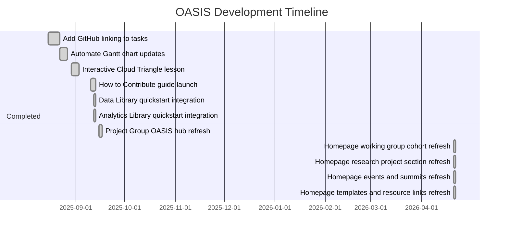

# Development Schedule

> Archive note: This page documents the 2025 OASIS launch roadmap and is kept
> for historical context. Active prioritization should happen in GitHub issues
> and pull requests.

This page remains in the site as a reference timeline for the initial homepage,
quickstart, and tag system rollout.

See [Development Requests](dev-requests.md) for external requests made of the team.

Since February 2025, OASIS grew from an initial scaffold into a tagged
documentation site. Late August 2025 added sidebar tag pages, fixed tag links,
and launched the Cloud Triangle lesson with examples. Early September 2025
expanded the ecosystem with the [How to Contribute guide](https://cu-esiil.github.io/how_to_contribute/),
new quickstarts pointing to the [Data Library](https://cu-esiil.github.io/data-library/)
and [Analytics Library](https://cu-esiil.github.io/analytics-library/), and a
refreshed [Project Group OASIS hub](https://cu-esiil.github.io/Project_group_OASIS/).
April 2026 focused on homepage curation: working groups were reorganized into
cohort rows, research sections were expanded for graduate student and staff
projects, event and template cards were refreshed, and key external links such
as the container library destination were updated. Late May 2026 focused on
restoring and hardening the redesigned homepage, splitting directory galleries,
refining the visual system, preserving and managing thumbnail sets, and
strengthening CI coverage. June 2026 added the organization metadata graph,
generated Explore theme pages, and the first Event Groups directory and gallery
structure.

## Recent Updates Since April 2026

### 2026-05-28 — Homepage restoration and CI hardening

- Restored the redesigned custom homepage after rendering issues.
- Cleaned stale repo structure and asset organization.
- Removed lingering analytics-library submodule metadata.
- Strengthened Playwright and link-health coverage in CI/deploy workflows.

### 2026-05-28 — Ecosystem directory split

- Split the old all-in-one ecosystem directory into dedicated gallery subpages
  for working groups, research, events, and infrastructure.
- Fixed blank/failed browser-back behavior across the custom homepage
  experience.

### 2026-05-28 to 2026-05-29 — Responsive, footer, branding, and thumbnail system

- Added narrow-window homepage fixes and regression checks.
- Replaced the lower footer with the institutional footer pattern.
- Tightened the header logo and repaired dark mode behavior.
- Built a durable thumbnail-management system with preserved originals, active
  thumbnails, a manifest, and documentation.

### 2026-05-29 — Hero, interlude, and visual pacing pass

- Split ESIIL/OASIS marks.
- Added OASIS hero artwork and biology flourishes.
- Added and refined full-width interlude banners.
- Repaired panel-derived thumbnails with real transparency and tighter crops.

### 2026-06-09 — Metadata graph and Explore system

- Added a static organization-wide metadata graph system.
- Generated initial Explore theme pages.
- Added graph CI/test scaffolding.
- Added starter registry content for projects, people, themes, datasets, and
  schema.

### 2026-06-09 to 2026-06-10 — Event Groups section

- Added a dedicated Event Groups homepage band below Events & Summits.
- Corrected the Event Groups section so it does not duplicate the public event
  archive.
- Added a dedicated Event Groups directory page.
- June 10 status: the full gallery model for confirmed event-group sets was
  still a follow-up for Hackathon 2023, Innovation Summit 2024, Forest Carbon
  Codefest 2024, Innovation Summit 2025, and Innovation Summit 2026.

### 2026-06-10 — Graph test harness fix

- Added repo-root path handling for pytest after CI reported
  `ModuleNotFoundError: No module named 'scripts'`.

### 2026-06-15 — Event Groups gallery completion

- Added event-level gallery pages for Hackathon 2023, Innovation Summit 2024,
  Forest Carbon Codefest 2024, Innovation Summit 2025, and Innovation Summit
  2026.
- Added Event Group Galleries navigation and registry metadata for the new
  gallery collections.

## Historical Task List

- [x] [Initial repository setup](https://github.com/CU-ESIIL/home/commit/323aea0) — 2025-02-05
- [x] [Tag-based navigation](https://github.com/CU-ESIIL/home/pull/29) — 2025-08-13
- [x] [Static tag system](https://github.com/CU-ESIIL/home/pull/32) — 2025-08-14
- [x] [Repository structure docs](https://github.com/CU-ESIIL/home/pull/34) — 2025-08-14
- [x] [Development schedule page](https://github.com/CU-ESIIL/home/pull/35) — 2025-08-14

- [x] [Sidebar tag pages](https://github.com/CU-ESIIL/home/pull/55) — 2025-08-19
- [x] [Fix tag links in sidebar](https://github.com/CU-ESIIL/home/pull/56) — 2025-08-19
- [x] [Cloud Triangle scaffold](https://github.com/CU-ESIIL/home/pull/57) — 2025-08-22
- [x] [Cloud Triangle overview](https://github.com/CU-ESIIL/home/pull/58) — 2025-08-22
- [x] [Cloud Triangle examples & figure](https://github.com/CU-ESIIL/home/pull/59) — 2025-08-22
- [x] [How to Contribute guide launch](https://cu-esiil.github.io/how_to_contribute/) — 2025-09-12
- [x] [Data Library quickstart integration](https://github.com/CU-ESIIL/home/commit/e2d76a5) — 2025-09-12
- [x] [Analytics Library quickstart integration](https://github.com/CU-ESIIL/home/commit/f69d9da) — 2025-09-12
- [x] [Project Group OASIS hub refresh](https://cu-esiil.github.io/Project_group_OASIS/) — 2025-09-16
- [x] [Homepage working group cohort refresh](index.md) — 2026-04-21
- [x] [Homepage research project section refresh](index.md) — 2026-04-21
- [x] [Homepage events and summits refresh](index.md) — 2026-04-21
- [x] [Homepage templates and resource links refresh](index.md) — 2026-04-21
- [x] [Homepage restoration and CI hardening](index.md) — 2026-05-28
- [x] [Ecosystem directory gallery split](directory/index.md) — 2026-05-28
- [x] [Mobile responsiveness and footer refinements](index.md) — 2026-05-28
- [x] [Branding, dark mode, and header refinements](index.md) — 2026-05-28
- [x] [Thumbnail management system](assets/thumbnails/README.md) — 2026-05-28
- [x] [OASIS hero, interlude banners, and biology flourishes](index.md) — 2026-05-29
- [x] [Panel-derived thumbnail repair and crop pass](assets/thumbnails/README.md) — 2026-05-29
- [x] [Organization metadata graph and Explore pages](explore/index.md) — 2026-06-09
- [x] [Event Groups homepage band and directory page](event-groups/index.md) — 2026-06-09 to 2026-06-10
- [x] [Graph CI test harness fix](https://github.com/CU-ESIIL/home/actions) — 2026-06-10
- [x] [Event Groups gallery completion](event-groups/index.md) — 2026-06-15

## Upcoming Task List

<!-- upcoming-start -->
_No active roadmap items are tracked on this archived page._
<!-- upcoming-end -->

## Timeline Overview

| Task | Start | End | Contributors |
|------|-------|-----|--------------|
| Initial repository setup | 2025-02-05 | 2025-02-05 | [Ty Tuff](https://github.com/tytuff) |
| Tag-based navigation | 2025-08-13 | 2025-08-13 | [Ty Tuff](https://github.com/tytuff) |
| Static tag system | 2025-08-14 | 2025-08-14 | [Ty Tuff](https://github.com/tytuff) |
| Repository structure docs | 2025-08-14 | 2025-08-14 | [Ty Tuff](https://github.com/tytuff) |
| Development schedule page | 2025-08-14 | 2025-08-14 | [Ty Tuff](https://github.com/tytuff) |
| Sidebar tag pages | 2025-08-19 | 2025-08-19 | [Ty Tuff](https://github.com/tytuff) |
| Fix tag links in sidebar | 2025-08-19 | 2025-08-19 | [Ty Tuff](https://github.com/tytuff) |
| Cloud Triangle scaffold | 2025-08-22 | 2025-08-22 | [Ty Tuff](https://github.com/tytuff) |
| Cloud Triangle overview | 2025-08-22 | 2025-08-22 | [Ty Tuff](https://github.com/tytuff) |
| Cloud Triangle examples & figure | 2025-08-22 | 2025-08-22 | [Ty Tuff](https://github.com/tytuff) |
| Add GitHub linking to tasks | 2025-08-15 | 2025-08-21 | TBD |
| Automate Gantt chart updates | 2025-08-22 | 2025-08-26 | TBD |
| How to Contribute guide launch | 2025-09-10 | 2025-09-12 | OASIS Team |
| Data Library quickstart integration | 2025-09-12 | 2025-09-12 | [Ty Tuff](https://github.com/tytuff) |
| Analytics Library quickstart integration | 2025-09-12 | 2025-09-12 | [Ty Tuff](https://github.com/tytuff) |
| Project Group OASIS hub refresh | 2025-09-15 | 2025-09-16 | OASIS Team |
| Homepage working group cohort refresh | 2026-04-21 | 2026-04-21 | OASIS Team |
| Homepage research project section refresh | 2026-04-21 | 2026-04-21 | OASIS Team |
| Homepage events and summits refresh | 2026-04-21 | 2026-04-21 | OASIS Team |
| Homepage templates and resource links refresh | 2026-04-21 | 2026-04-21 | OASIS Team |
| Homepage restoration and CI hardening | 2026-05-28 | 2026-05-28 | OASIS Team |
| Ecosystem directory gallery split | 2026-05-28 | 2026-05-28 | OASIS Team |
| Mobile responsiveness and footer refinements | 2026-05-28 | 2026-05-28 | OASIS Team |
| Branding, dark mode, and header refinements | 2026-05-28 | 2026-05-29 | OASIS Team |
| Thumbnail management system | 2026-05-28 | 2026-05-29 | OASIS Team |
| OASIS hero, interlude banners, and biology flourishes | 2026-05-29 | 2026-05-29 | OASIS Team |
| Panel-derived thumbnail repair and crop pass | 2026-05-29 | 2026-05-29 | OASIS Team |
| Organization metadata graph and Explore pages | 2026-06-09 | 2026-06-09 | OASIS Team |
| Event Groups homepage band and directory page | 2026-06-09 | 2026-06-10 | OASIS Team |
| Graph CI test harness fix | 2026-06-10 | 2026-06-10 | OASIS Team |
| Event Groups gallery completion | 2026-06-15 | 2026-06-15 | OASIS Team |

## Gantt Chart

```mermaid
gantt
    dateFormat  YYYY-MM-DD
    title OASIS Development Timeline
%% gantt-start
    section Completed
    Add GitHub linking to tasks  :done, plan1, 2025-08-15, 7d
    Automate Gantt chart updates  :done, plan2, 2025-08-22, 5d
    Interactive Cloud Triangle lesson  :done, plan3, 2025-08-29, 5d
    How to Contribute guide launch  :done, plan4, 2025-09-10, 3d
    Data Library quickstart integration  :done, plan5, 2025-09-12, 1d
    Analytics Library quickstart integration  :done, plan6, 2025-09-12, 1d
    Project Group OASIS hub refresh  :done, plan7, 2025-09-15, 2d
    Homepage working group cohort refresh  :done, plan8, 2026-04-21, 1d
    Homepage research project section refresh  :done, plan9, 2026-04-21, 1d
    Homepage events and summits refresh  :done, plan10, 2026-04-21, 1d
    Homepage templates and resource links refresh  :done, plan11, 2026-04-21, 1d
%% gantt-end
```

