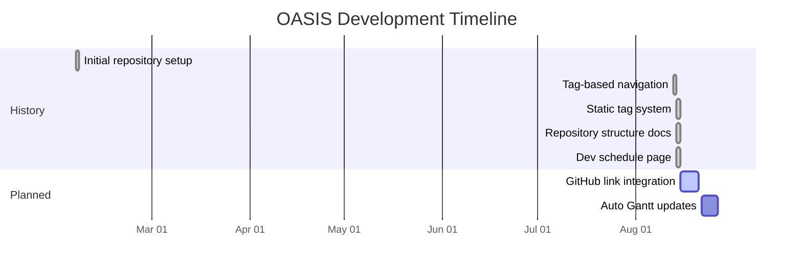

# Development Schedule

A collaborative timeline for OASIS development. Update this page through pull requests and link to contributions as tasks are completed.

Since February 2025, OASIS has grown from an initial scaffold into a tagged documentation site. Recent work in August 2025 introduced tag-based navigation, a static tag system, and documentation of the repository structure. Our next steps are to link tasks directly to GitHub issues and automate Gantt chart updates so the roadmap stays current.

## Historical Task List

- [x] [Initial repository setup](https://github.com/CU-ESIIL/home/commit/323aea0) — 2025-02-05
- [x] [Tag-based navigation](https://github.com/CU-ESIIL/home/pull/29) — 2025-08-13
- [x] [Static tag system](https://github.com/CU-ESIIL/home/pull/32) — 2025-08-14
- [x] [Repository structure docs](https://github.com/CU-ESIIL/home/pull/34) — 2025-08-14
- [x] [Development schedule page](https://github.com/CU-ESIIL/home/pull/35) — 2025-08-14

## Upcoming Task List

- [ ] [Add GitHub linking to tasks](https://github.com/CU-ESIIL/home/issues/TBD)
- [ ] [Automate Gantt chart updates](https://github.com/CU-ESIIL/home/issues/TBD)

## Timeline Overview

| Task | Start | End | Contributors |
|------|-------|-----|--------------|
| Initial repository setup | 2025-02-05 | 2025-02-05 | [Ty Tuff](https://github.com/tytuff) |
| Tag-based navigation | 2025-08-13 | 2025-08-13 | [Ty Tuff](https://github.com/tytuff) |
| Static tag system | 2025-08-14 | 2025-08-14 | [Ty Tuff](https://github.com/tytuff) |
| Repository structure docs | 2025-08-14 | 2025-08-14 | [Ty Tuff](https://github.com/tytuff) |
| Development schedule page | 2025-08-14 | 2025-08-14 | [Ty Tuff](https://github.com/tytuff) |
| Add GitHub linking to tasks | 2025-08-15 | 2025-08-21 | TBD |
| Automate Gantt chart updates | 2025-08-22 | 2025-08-26 | TBD |

## Gantt Chart

