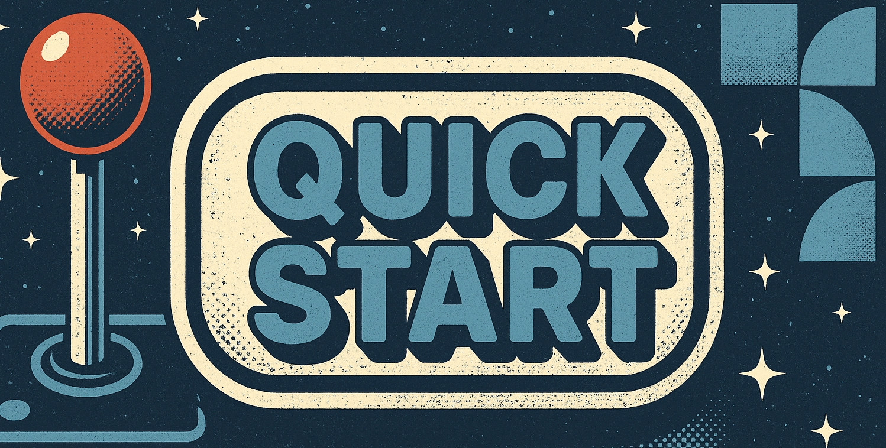

---
hide:
  - toc
---

<!-- Static Header Section -->

    

<!-- Main Content -->

    <h1 class="oasis-header">Open Analysis and Synthesis Infrastructure for Science</h1>
    

      <form action="search/" method="get" class="search-form">
        <input type="search" name="q" placeholder="Search..." aria-label="Search" />
        <button type="submit" aria-label="Submit search">🔍</button>
      </form>
      

        <a href="./quickstart/" class="tag">Quickstart</a>
        <a href="./container-library/" class="tag">Containers</a>
        <a href="./analytics-library/" class="tag">Analytics</a>
        <a href="./data-library/" class="tag">Data Library</a>
        <a href="./resources/" class="tag">Resources</a>
      

    

    
Welcome to the <strong>OASIS</strong>, a hub for open analysis and synthesis in <strong>Environmental Data Science</strong>.

<!-- Quick Start Button -->

  <a class="qs-btn" href="./quickstart/" role="button" aria-label="Open Quick Start">
    
    <!-- Corner badge -->
    CLICK
    <!-- Bottom CTA bar -->
    
      ▶
      Open Quick Start
    
  </a>

<!-- Shared hover animation for linked images -->

---
## 📚 Data & Analytics Libraries

  

    
    
<strong>Data Library</strong>

    
Organizational hub for ESIIL datasets.

  

  

    
    
<strong>Analytics Library</strong>

    
Repository for data harmonization and analytics.

  

  

    
    
<strong>Container Image Library</strong>

    
Browse available container images for ESIIL computing.

  

  

    
    
<strong>Advanced Textbook</strong>

    
Comprehensive guide to environmental data science.

  

  Tags: environmental data science, synthesis, open science, analytics, ESIIL

---

## 🚀 **NSF Synthesis Working Groups**  

  

    
    
<strong>BioViewPoint</strong>

    
Visualization tools for biodiversity data.

  

  

    
    
<strong>Extreme Wildfire</strong>

    
Investigating extreme wildfire behavior.

  

  

    
    
<strong>Fungal Dispersal</strong>

    
ESIIL working group on fungal dispersal.

  

  

    
    
<strong>Macrophenology</strong>

    
Macroecological patterns in phenology.

  

  

    
    
<strong>Maka-Sitomniya</strong>

    
Research on traditional ecological knowledge.

  

  

    
    
<strong>AI for Natural Methane</strong>

    
Harmonizing natural methane datasets using AI.

  

  

    
    
<strong>Zooplankton Indicator Dataset</strong>

    
Dataset and tools for zooplankton as environmental indicators.

  

---
## 🎓 **NSF Synthesis Postdoc Researcher Projects**  
These repositories represent postdoc-led research initiatives at ESIIL.

  

    
    
<strong>Datacube Sandbox</strong>

    
Training and practice space for data cubes.

  

  

    
    
<strong>Biotic Niche Modeling</strong>

    
Research on species niche dynamics.

  

  

    
    
<strong>Nutrient Flows</strong>

    
Analysis of seafood trade and sustainability.

  

  

    
    
<strong>LTER Material Legacies</strong>

    
Impact of dead tree legacies on forest resilience.

  

  

    
    
<strong>Team Science</strong>

    
Studying scientific collaboration networks.

  

  

    
    
<strong>Opt Decision Making</strong>

    
Optimization and decision science.

  

  

    
    
<strong>Water Carbon Dynamics</strong>

    
Investigating water-carbon interactions.

  

  

    
    
<strong>Cultural ES WildfireRx</strong>

    
Wildfire effects on cultural ecosystem services.

  

  

    
    
<strong>SCE Wildfire</strong>

    
Socioecological impacts of wildfire.

  

 

    
    
<strong>Tundra Shrub Expansion</strong>

    
Remote sensing tools for alpine ecosystems.

  

---

## 🔬 **Staff and Affiliate Research Projects**  
These repositories represent broader research efforts contributing to environmental data science.

| Name | Description | Link |
|------|------------|------|
| **[SpectralBEF](https://cu-esiil.github.io/spectralBEF/)** | Spectral analysis of biodiversity-ecosystem functioning. | 🔗 Website |
| **[GEDI-ECOSTRESS Data Project](https://github.com/CU-ESIIL/GEDI-ECOSTRESS_data_project)** | Aligning GEDI and ECOSTRESS datasets for ML applications. | 🔗 GitHub |

---

## 🎟️ **Events & Summits**  
Major ESIIL-hosted and affiliated events.

  

    
    
<strong>Innovation Summit 2025</strong>

    
Official repository for the ESIIL Innovation Summit 2025.

  

  

    
    
<strong>FIRE Plan 2024</strong>

    
Planning and strategy for fire management.

  

  

    
    
<strong>Innovation Summit 2024</strong>

    
Official repo for the ESIIL Innovation Summit 2024.

  

  

    
    
<strong>Forest Carbon Codefest</strong>

    
Hands-on coding event for forest carbon research.

  

  

    
    
<strong>HYR-SENSE</strong>

    
Remote sensing.

  

  
  

    
    
<strong>AGU 2023 Innovation Session</strong>

    
Maximizing Stakeholder Engagement in Open Environmental Data Science.

  

---

## 🛠️ **OASIS Templates & Reusable Frameworks**  
Templates to streamline project development and research collaboration.

  

  

    
    
<strong>Postdoc OASIS</strong>

    
Template for postdoc research documentation.

  

  

    
    
<strong>Working Group OASIS</strong>

    
Central hub for information on ESIIL working groups.

  

  
  

    
    
<strong>Base GitHub Pages</strong>

    
Starter repository for GitHub Pages projects.

  

  
  

    
    
<strong>Education OASIS</strong>

    
Template for ESIIL education students to create their own OASIS.

  

  

    
    
<strong>Slideshow OASIS</strong>

    
Basic slideshow template for presentations.

  

---

## 📖 **Tutorials**  
Guides and walkthroughs to help researchers and students learn new tools and techniques.

| Name | Description | Link |
|------|------------|------|
| **[Haskell Data Cube](https://github.com/CU-ESIIL/Haskell-data-cube)** | Creating data cubes with multi-source remote sensing data. | 🔗 GitHub |
| **[CI/CD Demo](https://github.com/CU-ESIIL/CI_CD_Demo)** | Demonstration repository for continuous integration and deployment. | 🔗 GitHub |
| **[Haskell API Demo](https://github.com/CU-ESIIL/Haskell-api-demo)** | Sensing the Earth workshop demonstration. | 🔗 GitHub |

---

## 🏗️ **CI Infrastructure & Tools**  
Repositories focused on software, data infrastructure, and computational tools.

  

    
    
<strong>Docker</strong>

    
Private repository for containerized workflows and CI/CD.

  

  

    
    
<strong>CyVerse Utils</strong>

    
Utilities for working with CyVerse infrastructure.

  

  

    
    
<strong>OASIS Docker Demo</strong>

    
Public demonstration of Dockerized workflows.

  

  

    
    
<strong>Min Docker Demo</strong>

    
Minimal demonstration for Docker containers.

  

  

    
    
<strong>CyVerse Issues</strong>

    
Documenting known issues in CyVerse workflows.

  

  

    
    
<strong>Development Schedule</strong>

    
Living task list and timeline for OASIS development.

  

  

---

## 🎓 **Teaching Resources**  
Repositories containing materials for courses, workshops, and tutorials.

| Name | Description | Link |
|------|------------|------|
| **[Pre-Innovation Summit Training](https://cu-esiil.github.io/pre-innovation-summit-training/)** | Repository for all things pre-innovation-summit-training. | 🔗 Website |
| **[EDS Demo](https://cu-esiil.github.io/eds_demo/)** | Example repository for environmental data science education. | 🔗 Website |
| **[Git & GitHub Fundamentals](https://github.com/CU-ESIIL/git-github-fundamentals-eculler)** | GitHub Classroom-created fundamentals course. | 🔗 GitHub |
| **[WG PI Orientation](https://cu-esiil.github.io/WG_PI_Orientation/)** | Orientation materials for ESIIL working group PIs. | 🔗 Website |

---

## ❌ **To Be Deleted**  
These repositories are marked for removal.

| Name | Description | Link |
|------|------------|------|
| **[Shannon-Boldt](https://github.com/CU-ESIIL/Shannon-Boldt)** | Private repository, marked for deletion. | 🔗 GitHub |
| **[Ty Ed Demo](https://cu-esiil.github.io/Ty_ed_demo/)** | One-time use education repository. | 🔗 Website |
| **[Ty Test](https://cu-esiil.github.io/Ty_test/)** | Single-use education test repository. | 🔗 Website |

---

# 🏛️ **Group Sub-Repositories**

This section contains sub-repositories from various events, including the **Innovation Summit, HYR-SENSE, FCC24, and Hackathon 2023**. These repos represent collaborative breakout group projects and associated work.

---

## 🌟 **Innovation Summit 2024 Breakout Groups**

| Name | Description | Link |
|------|------------|------|
| **[Innovation-Summit-2024__3](https://github.com/CU-ESIIL/Innovation-Summit-2024__3)** | Breakout group 3 from the Innovation Summit 2024. | 🔗 GitHub |
| **[Innovation-Summit-2024__4](https://github.com/CU-ESIIL/Innovation-Summit-2024__4)** | Breakout group 4 from the Innovation Summit 2024. | 🔗 GitHub |
| **[Innovation-Summit-2024__5](https://github.com/CU-ESIIL/Innovation-Summit-2024__5)** | Breakout group 5 from the Innovation Summit 2024. | 🔗 GitHub |
| **[Innovation-Summit-2024__6](https://github.com/CU-ESIIL/Innovation-Summit-2024__6)** | Breakout group 6 from the Innovation Summit 2024. | 🔗 GitHub |

---

## 🌍 **HYR-SENSE Workshop Group Repositories**

| Name | Description | Link |
|------|------------|------|
| **[HYR-SENSE-Alaska](https://github.com/CU-ESIIL/HYR-SENSE-Alaska)** | HYR-SENSE Alaska breakout group. | 🔗 GitHub |
| **[HYR-SENSE-Tyler](https://github.com/CU-ESIIL/HYR-SENSE-Tyler)** | HYR-SENSE Tyler breakout project. | 🔗 GitHub |
| **[HYR-SENSE-VTaho](https://github.com/CU-ESIIL/HYR-SENSE-VTaho)** | HYR-SENSE Vermont-Tahoe research group. | 🔗 GitHub |
| **[HYR-SENSE-MaryB](https://github.com/CU-ESIIL/HYR-SENSE-MaryB)** | HYR-SENSE research led by Mary B. | 🔗 GitHub |

---

## 🔬 **FCC24 Group Repositories**

| Name | Description | Link |
|------|------------|------|
| **[FCC24_Group_1](https://github.com/CU-ESIIL/FCC24_Group_1)** | Group 1 from FCC24. | 🔗 GitHub |
| **[FCC24_Group_2](https://github.com/CU-ESIIL/FCC24_Group_2)** | Group 2 from FCC24. | 🔗 GitHub |
| **[FCC24_Group_3](https://github.com/CU-ESIIL/FCC24_Group_3)** | Group 3 from FCC24. | 🔗 GitHub |
| **[FCC24_Group_4](https://github.com/CU-ESIIL/FCC24_Group_4)** | Group 4 from FCC24. | 🔗 GitHub |
| **[FCC24_Group_5](https://github.com/CU-ESIIL/FCC24_Group_5)** | Group 5 from FCC24. | 🔗 GitHub |
| **[FCC24_Group_6](https://github.com/CU-ESIIL/FCC24_Group_6)** | Group 6 from FCC24. | 🔗 GitHub |

---

## 🚀 **Hackathon 2023 Group Repositories**

| Name | Description | Link |
|------|------------|------|
| **[hackathon2023_A](https://github.com/CU-ESIIL/hackathon2023_A)** | Breakout group A from Hackathon 2023. | 🔗 GitHub |
| **[hackathon2023_B](https://github.com/CU-ESIIL/hackathon2023_B)** | Breakout group B from Hackathon 2023. | 🔗 GitHub |
| **[hackathon2023_C](https://github.com/CU-ESIIL/hackathon2023_C)** | Breakout group C from Hackathon 2023. | 🔗 GitHub |
| **[hackathon2023_D](https://github.com/CU-ESIIL/hackathon2023_D)** | Breakout group D from Hackathon 2023. | 🔗 GitHub |
| **[hackathon2023_E](https://github.com/CU-ESIIL/hackathon2023_E)** | Breakout group E from Hackathon 2023. | 🔗 GitHub |
| **[hackathon2023_F](https://github.com/CU-ESIIL/hackathon2023_F)** | Breakout group F from Hackathon 2023. | 🔗 GitHub |
| **[hackathon2023_G](https://github.com/CU-ESIIL/hackathon2023_G)** | Breakout group G from Hackathon 2023. | 🔗 GitHub |

---

📧 **Contact**: [esiil-support@cu.edu](mailto:esiil-support@cu.edu)

