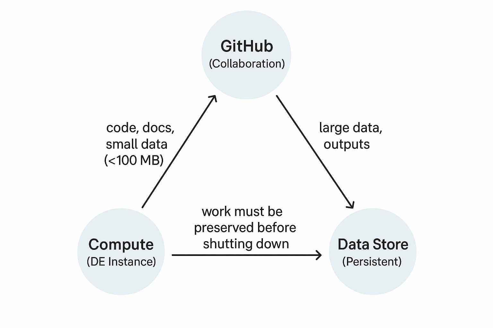

# Chapter: Working the CyVerse Cloud Triangle

> **What you’ll learn**
> Launch a CyVerse Discovery Environment (DE) JupyterLab session, connect to GitHub with SSH through the Git sidebar, move data with GoCommands, and—most importantly—keep your work alive after an ephemeral compute session ends.


## 1. Why the Triangle?

Across science platforms like **BinderHub**, **JupyterHub classrooms**, and cloud services such as **Azure ML** or **Vertex AI Workbench**, the same pattern repeats:

1. **GitHub** (or GitLab, etc.) for *code & collaboration*  
2. **Ephemeral compute** (JupyterLab, containerized notebooks, VICE apps) for *analysis*  
3. **Persistent storage** (cloud volumes, object stores, CyVerse Data Store) for *datasets and results*

This is the **Cloud Triangle**. It’s not bureaucracy—it’s the habit that keeps your work reproducible, durable, and shareable.

Think of it like this:

- **Compute** = your scratch pad: fast but disposable  
- **GitHub** = your lab notebook: versioned, accountable, and collaborative  
- **Data Store** = your filing cabinet: heavy, permanent, and backed up



> **Golden Rule**  
> Never let the only copy of your work live on the instance. If you don’t push to GitHub or save to the Data Store, it will vanish when compute stops.

---

## 2. The Routine (clone → compute → preserve)

1. **Launch an instance.**  
   In the Discovery Environment, start a **JupyterLab** session using the course’s containerized image so everyone shares the same software.

2. **Connect GitHub (no shell required).**
   Open the **Git** sidebar → **Clone a Repository** → paste your SSH URL `git@github.com:ORG/REPO.git` (e.g., `git@github.com:CU-ESIIL/Ty_ed_demo.git` to practice).
   Stage with checkboxes, write a message, **Commit**, then **Push**.

3. **Fetch data (stream only what you need).**  
   Use **GoCommands** (resumable transfers) to pull datasets from the CyVerse Data Store.  
   With the `i:` prefix you copy exactly what you need into `./data/` for this run.

4. **Compute (scratch space mindset).**  
   Treat the instance like a **scratch pad**. Run notebooks, generate intermediates, iterate fast.  
   Remember: the VM is temporary; don’t assume its local files will persist.

5. **Preserve (separate code from data).**  
   - **Code & small artifacts → GitHub**  
   - **Large outputs → Data Store**  
   When both are saved, **shut down** the instance—nothing important is left behind.

This rhythm—**clone → compute → preserve**—is the Cloud Triangle in motion. 

---

## 3. Anatomy of the Cloud Triangle 

A) Compute — CyVerse DE / Jetstream2
- **Instance (VM / VICE app)**  
  **What:** A running virtual machine in CyVerse DE that pairs a hardware profile with a container image.  
  **Why:** Everyone starts identical; you “rent” compute only while it’s on; local files are temporary.  
  **How (here):** DE → *Apps* → **JupyterLab** → launch with the course preset.

- **Image → Container**  
  **What:** An **image** is a frozen software recipe; a **container** is that image running inside your instance.  
  **Why:** Reproducibility—no “works on my laptop” drift.  
  **How (here):** Use the **ESIIL large spatial analysis** image (satellite-focused). For repeat needs, bake changes into a new image rather than ad‑hoc installs.

- **Hardware profile**  
  **What:** vCPUs, RAM, GPUs, and disk size for your instance.  
  **Why:** Right-size performance while sharing resources fairly.  
  **How (here):** Pick the **Jetstream2** course profile provided in DE.

- **Jetstream2**  
  **What:** NSF cloud where many DE apps run.  
  **Why:** Academic cloud at scale for on-demand classrooms and research.  
  **How (here):** Your instance is scheduled on Jetstream2 when you launch JupyterLab.

- **ACCESS-CI (when you need more)**  
  **What:** Program to obtain larger/longer compute allocations.  
  **Why:** Run bigger jobs without straining shared classroom quotas.  
  **How (here):** If you consistently outgrow presets, request an allocation and attach that hardware pack to your DE launches.

- **Local disk (instance scratch)**  
  **What:** The filesystem inside your VM (e.g., your working directory `~`).  
  **Why:** Fast for computation and intermediates but **ephemeral**—can disappear when the app stops.  
  **How (here):** Work in `./data/` or `./tmp/` during the session; before stopping, move deliverables to persistent storage (see Storage).

---

B) Persistent Storage — CyVerse Data Store (UArizona)
- **Remote disk (Data Store / iRODS)**  
  **What:** Your durable home at `/iplant/home/<username>` hosted at the University of Arizona, behind a firewall.  
  **Why:** Backed‑up, shareable, and persists beyond any single VM.  
  **How (here):** From compute, use the `i:` prefix for paths, e.g., `i:/iplant/home/<username>/projects/...`.

- **Network layout (why local ≠ remote)**  
  **What:** Compute (Jetstream2) and storage (UArizona Data Store) live in different places and are separated by a firewall.  
  **Why:** Expect latency; uploading/downloading is a deliberate step—don’t assume local files persist.  
  **How (here):** Pull **only what you need** for a run; push results back when done.

- **GoCommands (data mover)**  
  **What:** Cross‑platform CLI for robust, resumable, checksum‑verified transfers to/from the Data Store.  
  **Why:** Reliable for “data are heavy” workflows and long‑running moves.  
  **How (here):** Use `i:` paths with GoCommands to move between the VM and `/iplant/home/<username>/...`. For small items, the DE file browser is fine.

---

C) GitHub — Code, Website & Auth (Jupyter‑first)
- **Git (JupyterLab Git widget) — Clone vs Repo modes**  
  **What:** Built‑in panel for clone, stage, commit, push—no terminal needed.  
  **Why:** Safer staging (you can see file sizes), fewer auth pitfalls, harder to accidentally commit huge data.  
  **How (here):**  
  1) **Pre‑req:** Set up **SSH key** *or* **Web Authentication** (2FA via browser) first.  
  2) **Be in your top‑level working folder** in the file browser (the place you want the repo folder to appear).  
  3) Open the **Git** sidebar (left toolbar).  
    • **Not in a repo yet:** You’ll see **three blue buttons** (e.g., *Clone a Repository*, *Create a New Repository*, *Open a Repository*). Click **Clone a Repository** and paste your SSH URL `git@github.com:ORG/REPO.git` (e.g., `git@github.com:CU-ESIIL/Ty_ed_demo.git` to practice).
    • **Already inside a repo folder:** You’ll see the **status panel** (Unstaged ↔ Staged changes, commit message box) with **Commit / Push / Pull** buttons. Use checkboxes to stage only what you intend to version.
  > **Tip:** Keep big data out of Git. The widget’s file‑by‑file staging makes it obvious when you’re about to add large artifacts—uncheck them and use the Data Store instead.

- **SSH key (for GitHub)**  
  **What:** Password‑less credential stored in `~/.ssh/` inside the instance.  
  **Why:** Works cleanly with 2FA; avoids repeated prompts.  
  **How (here):** Generate once on an instance, add the **public** key to GitHub (*Settings → SSH keys*). The Git widget will push/pull over SSH automatically.

- **Web Authentication (2FA via browser) — optional HTTPS path**  
  **What:** Uses the `gh` CLI to open a browser and store a token; Git delegates credentials to `gh`.  
  **Why:** Handy on ephemeral VMs when you don’t want to manage SSH keys.  
  **How (here):** Run the provided notebook cell once per new instance to log in via web; after that the Git widget can operate over HTTPS.

- **GitHub Pages (project website)**  
  **What:** A static site built directly from your repo.  
  **Why:** Push once; your docs/tutorials publish automatically.  
  **How (here):** In GitHub → **Settings → Pages** → *Deploy from a branch* → `main` + `/docs`. Put site files in `/docs/` (e.g., `docs/index.md`), then Commit/Push from the widget.  
  > From pages in `docs/quickstart/...`, use `../assets/...` (or `{{ '/assets/... ' | relative_url }}` if using Jekyll) so paths don’t duplicate `docs/`.

- **Markdown (docs & Pages authoring)**  
  **What:** Plain‑text syntax for structured docs (headings, lists, links, images, code). Renders consistently on GitHub and on your Pages site.  
  **Why:** Fast, versionable, and reviewable; encourages clear communication. Perfect for lab notes, assignments, and how‑tos.  
  **How (here):**  
  1. Put site files in `/docs/` (e.g., `docs/index.md`, `docs/quickstart/getting-started.md`).  
  2. Use relative links between pages: `[Next →](../quickstart/getting-started.md)`.  
  3. Images from a page under `docs/quickstart/`: `../assets/...`  *(or Jekyll: `{{ '/assets/... ' | relative_url }}`)*.  
  4. Code fences for reproducible snippets:
     ```python
     # example
     print("hello, world")
     ```  
  5. Optional Jekyll front matter for page metadata:
     ```yaml
     ---
     title: Getting Started
     layout: default
     ---
     ```


- **GitHub CLI (`gh`) — optional power tool**  
  **What:** Command‑line helper for GitHub tasks (auth, PRs, releases).  
  **Why:** Useful for scripted workflows and browser‑based 2FA login on ephemeral instances.  
  **How (here):** Use `gh auth login --web` to establish HTTPS credentials, or for advanced operations (opening PRs, viewing issues).  
  **Caveat:** The CLI doesn’t “protect” you from committing large files—Git will still reject pushes over size limits. The **widget’s staging UI** makes it easier to avoid adding big data in the first place. Keep large artifacts in the **CyVerse Data Store**, not in Git.

A sensible `.gitignore` starter (to reduce accidents)
```gitignore
# keep heavy data out of git
data/
*.tif
*.tiff
*.h5
*.hdf5
*.nc
*.zip
*.tar
*.parquet
*.feather

# notebooks: keep checkpoints out
.ipynb_checkpoints/

# environments & caches
.env
.venv/
__pycache__/
*.pyc
```

---

Golden workflow
**Clone (GitHub) → Compute (local scratch) → Preserve (GitHub + Data Store) → Shut down.**  
Remember: compute runs on Jetstream2; persistent storage is at UArizona behind a firewall—plan transfers, don’t assume local files persist.

---

## 4. Go through the routine yourself (step-by-step)

1. **Launch an instance.**  
   Choose the course JupyterLab image and start it in CyVerse DE.  
   [](https://de.cyverse.org/apps/de/faf1d268-44cc-11ed-9715-008cfa5ae621/launch?saved-launch-id=dc65718e-1964-4d11-99ad-bf901cddda99)

2. **Set up GitHub auth (one-time on each new VM).**

   **2A. SSH (recommended)** — works cleanly with 2FA, no passwords.

   ```python
   import os, subprocess, textwrap

   def add_github_to_known_hosts():
       ssh_dir = os.path.expanduser("~/.ssh")
       known_hosts = os.path.join(ssh_dir, "known_hosts")
       os.makedirs(ssh_dir, exist_ok=True)
       out = subprocess.run(
           ["ssh-keyscan", "-t", "rsa,ed25519", "github.com"],
           capture_output=True, text=True, check=True
       ).stdout.strip()
       with open(known_hosts, "a") as fh:
           if out:
               fh.write(out + "\n")
       print("github.com added to known_hosts")

   def configure():
       username = input("GitHub username: ")
       email = input("GitHub email: ")

       subprocess.run(["git", "config", "--global", "user.name", username], check=True)
       subprocess.run(["git", "config", "--global", "user.email", email], check=True)

       ssh_dir = os.path.expanduser("~/.ssh")
       os.makedirs(ssh_dir, exist_ok=True)
       key_path = os.path.join(ssh_dir, "github")  # ~./ssh/github and github.pub

       # Create Ed25519 keypair (no passphrase for this ephemeral VM)
       subprocess.run(["ssh-keygen", "-t", "ed25519", "-f", key_path, "-N", ""], check=True)

       # Minimal SSH config entry
       cfg_path = os.path.join(ssh_dir, "config")
       block = textwrap.dedent(f"""\
       Host github.com
         HostName github.com
         User git
         IdentityFile {key_path}
       """)
       with open(cfg_path, "a") as fh:
           fh.write(block)

       # Start agent and add key
       subprocess.run(f'eval "$(ssh-agent -s)" && ssh-add {key_path}', shell=True, check=True)

       add_github_to_known_hosts()

       with open(key_path + ".pub") as fh:
           pub = fh.read().strip()
       print("\nPublic key — copy to GitHub → Settings → SSH keys:\n")
       print(pub, "\n")

   configure()
   ```

   > Keys live in `~/.ssh/` (your **home**). Never use `/.ssh/` (the root).

   **Add this key to your GitHub profile (one time):**  
   1. Copy the **public key** the script printed (the line starting with `ssh-ed25519` or `ssh-rsa`).  
   2. In GitHub: click your avatar → **Settings** → **SSH and GPG keys** → **New SSH key**.  
   3. **Title:** `CyVerse VM` (or similar).  
   4. **Key:** paste the public key from the instance.  
   5. Click **Add SSH key**.  
   After this, GitHub recognizes this instance as you, and the JupyterLab **Git** widget can push/pull over SSH.

   **2B. Web Authentication (optional HTTPS path)** — if you prefer browser-based 2FA token via GitHub CLI:

   ```python
   # Activate env and login via web; then wire git -> gh credential helper
   !eval "$(conda shell.bash hook)" && conda activate macrosystems && yes | gh auth login --hostname github.com --web -p https
   !git config --global credential.helper '!eval "$(conda shell.bash hook)" && conda activate macrosystems && gh auth git-credential'
   !gh auth status
   ```

3. **Clone with the Git widget (Jupyter sidebar).**  
   - In the file browser, **navigate to your top-level working folder** (where you want the repo folder created).  
   - Open the **Git** sidebar (left toolbar).  
     - **If you’re not inside a repo yet:** you’ll see **three blue buttons** (e.g., *Clone a Repository*, *Create a New Repository*, *Open a Repository*). Click **Clone a Repository** and paste your SSH URL `git@github.com:ORG/REPO.git` (e.g., `git@github.com:CU-ESIIL/Ty_ed_demo.git` to practice).  
     - **If you are inside a repo folder:** you’ll see the **status panel** (Unstaged/Staged changes, commit box) with **Commit / Push / Pull**.  
   > Tip: Use the checkboxes to avoid staging large data files—keep those in the Data Store.

4. **Compute (scratch-space mindset).**  
   Run notebooks, generate intermediates locally. Assume local files can disappear when the app stops.

5. **Install GoCommands (data mover).**
   ```bash
   GOCMD_VER=$(curl -L -s https://raw.githubusercontent.com/cyverse/gocommands/main/VERSION.txt); \
   curl -L -s https://github.com/cyverse/gocommands/releases/download/${GOCMD_VER}/gocmd-${GOCMD_VER}-linux-amd64.tar.gz | tar zxvf -
   ./gocmd init
   ./gocmd whoami
   ```

   **During `./gocmd init`, you’ll be prompted for:**
   ```text
   iRODS Host [data.cyverse.org]:
   iRODS Port [1247]:
   iRODS Zone [iplant]:
   iRODS Username: <your CyVerse username>
   iRODS Password: <your CyVerse password>
   ```
   - Press **Enter** to accept the defaults in brackets for Host/Port/Zone.
   - Use your **CyVerse (DE) username/password** for the credentials prompts.
   - If you mistype anything, just rerun `./gocmd init` to correct it.
   - Settings are saved under `~/.irods/` and you can verify the login with `./gocmd whoami`.


6. **Fetch data (only what you need).**
   ```bash
   # 1) Create a local folder for this run (or use an existing folder you already have)
   mkdir -p data

   # 2) Copy from the CyVerse Data Store into ./data/
   #    IMPORTANT: replace <username> with your CyVerse username (NO angle brackets)
   #    Example path: i:/iplant/home/alovelace/projects/myproj/data/
   ./gocmd get --icat --retry 3 -d -k -r \
     i:/iplant/home/<username>/projects/myproj/data/ \
     ./data/
   ```bash
   mkdir -p data
   ./gocmd get --icat --retry 3 -d -k -r \
     i:/iplant/home/<username>/projects/myproj/data/ \
     ./data/
   ```

7. **Push outputs back (preserve results).**
   ```bash
   # 1) Push from local outputs/ to the Data Store
   #    IMPORTANT: replace <username> with your CyVerse username (NO angle brackets)
   #    Example remote folder: i:/iplant/home/alovelace/projects/myproj/outputs/
   ./gocmd put --diff --icat --retry 3 -d -k \
     outputs/run-20240101/ \
     i:/iplant/home/<username>/projects/myproj/outputs/
   ```bash
   ./gocmd put --diff --icat --retry 3 -d -k \
     outputs/run-20240101/ \
     i:/iplant/home/<username>/projects/myproj/outputs/
   ```

8. **Shut down safely (manage instances in DE).**  
   - In the CyVerse DE, go to the **Analyses** tab to see all running instances.  
   - **Auto-shutdown:** Analyses are set to stop automatically after **4 hours** unless you extend the time.  
   - **Extend runtime:** Click the **hourglass** next to your analysis to extend the time window. You can repeat this as needed for longer sessions.  
   - **Analysis ID:** The Analyses tab shows the **Analysis ID** — include this in support requests if something goes wrong.  
   - **Terminate:** Use the **red stop button** to end the instance when you’re done.

   > **Ethics of resource use**  
   > Choose an instance size and runtime that **match the job**. Big or long is fine when justified; what's not okay is locking up resources you aren't using. If a run is idle, extend only when you return, and terminate when finished.

   Code is in GitHub; data is in the Data Store—nothing important is left on the VM.

---

## 5. Good Project Habits

Design your repo so collaborators (and future‑you) can rerun it *without guessing*.

```
repo/
  README.md                 # what this does; how to run; links to Pages site
  env/                      # environment.yml or requirements.txt; container tag notes
  src/                      # source code (functions, modules)
  notebooks/                # small notebooks only (exploration, figures)
  configs/                  # YAML/JSON configs for runs; record parameters here
  data/                     # small samples only; real data lives in the Data Store
    README.md               # i: paths + size notes + fetch instructions
  outputs/                  # tiny examples only; real outputs go to Data Store
  scripts/                  # fetch_data.sh, push_outputs.sh, tiny helpers
```

**Why this layout?** Code in `src/` is reusable; notebooks stay lightweight; big artifacts live in persistent storage (Data Store), not in Git. This keeps clones fast and version history clean.

### `data/README.md` template (use this verbatim and edit)
```md
# Data for <project>

Primary storage: i:/iplant/home/<username>/projects/<proj>/data/

To fetch a working subset into this repo (replace <username> with YOUR CyVerse username — no angle brackets):

./gocmd get --icat --retry 3 -d -k -r \
  i:/iplant/home/<username>/projects/<proj>/data/ \
  ./data/

Notes:
- Approx size: <fill in>
- Provenance / last update: <fill in>
```

> Tip: put **just enough** sample data under `data/` (kilobytes/megabytes) so examples run quickly. Everything else: fetch with GoCommands.

### Tiny helper scripts (optional)
**scripts/fetch_data.sh**
```bash
#!/usr/bin/env bash
set -euo pipefail
mkdir -p data
# Replace USERNAME and PROJ
./gocmd get --icat --retry 3 -d -k -r \
  i:/iplant/home/USERNAME/projects/PROJ/data/ \
  ./data/
```

**scripts/push_outputs.sh**
```bash
#!/usr/bin/env bash
set -euo pipefail
# Replace USERNAME and PROJ
./gocmd put --diff --icat --retry 3 -d -k \
  outputs/ \
  i:/iplant/home/USERNAME/projects/PROJ/outputs/
```

Make them executable: `chmod +x scripts/*.sh`.

---

## 6. Before You Power Down (checklist)

- **Git:** Git sidebar shows no unstaged changes; latest commit **pushed**.
- **Data Store:** Required outputs uploaded with `./gocmd put`; spot‑check in DE File Browser or via `./gocmd ls i:/iplant/home/<username>/...`.
- **Repro notes:** Container/image tag recorded in `env/` and parameters in `configs/`.
- **Analysis info:** Copy your **Analysis ID** from the DE **Analyses** tab (include it in support requests).
- **Kernel & instance:** Restarted kernel if memory was tight; consider a larger **hardware profile** next launch if justified; then **terminate** the instance in **Analyses**.

> Golden rule: nothing important left only on the VM. Code → GitHub; data/results → Data Store.

---

## 7. Troubleshooting (by symptom)

- **Lost files after shutdown**  
  → They only lived on the instance. Rerun, re‑fetch data, and preserve work to GitHub/Data Store next time.

- **Push failed / asked for a password**  
  → Remote is HTTPS. Re‑clone via SSH (`git@github.com:ORG/REPO.git`) **and** add your SSH key to GitHub (Settings → SSH keys). In a terminal, you can test with: `ssh -T git@github.com`.

- **“Permission denied (publickey)” in the Git widget**  
  → You didn’t add the instance’s **public key** to GitHub yet, or the agent isn’t loaded. Add the key (Settings → SSH keys) and relaunch the widget; if needed, rerun the SSH setup cell.

- **Widget shows three blue buttons but you expected Commit/Push**  
  → You’re **not inside a repo folder**. In the file browser, open the repo directory you cloned; the status panel will appear.

- **GoCommands can’t see storage / auth fails**  
  → Rerun `./gocmd init`, accept defaults for host/port/zone, enter your CyVerse credentials; verify with `./gocmd whoami`.

- **“.h5 signature not found” or corrupted file**  
  → You likely saved an error page as `.h5`. Re‑download with `./gocmd get` and verify sizes.

- **Slow browser uploads**  
  → Keep browser uploads ≲ 2 GB. Use **GoCommands** for large transfers.

- **Out of memory / killed kernel**  
  → Save your work, shut down, then relaunch with a larger **hardware profile** (only if the job truly requires it). See the ethics note below.

---

## 8. Why This Works

Across BinderHub, JupyterHub, and cloud notebooks you’ll find the same pattern:

- **Ephemeral compute** for fast iteration (your scratch pad)
- **Git‑backed collaboration** for code and small artifacts (your lab notebook)
- **Persistent storage** for datasets and large outputs (your filing cabinet)

CyVerse DE + Jetstream2 + Data Store map cleanly onto this triangle. The result is work that’s **robust, repeatable, and explainable**.

> **Ethics of resource use**  
> Choose an instance size and runtime that **match the job**. Big/long runs are fine when justified; don’t lock up resources you aren’t using. Extend time in the **Analyses** tab only when you’re actively working, and **terminate** when finished.

---

## 9. Self‑Check (2 minutes)

1. What survives when the instance stops?  
2. Which tool do you use for a 20 GB transfer?  
3. Why SSH for GitHub instead of HTTPS?  
4. Where does the canonical copy of your dataset live?  
5. Where do you extend runtime or find your Analysis ID?

<details>
<summary>Answers</summary>

1. Only what you pushed to GitHub or saved in the Data Store.  
2. **GoCommands** (resumable, checksum‑aware, `i:` paths).  
3. SSH avoids passwords, works with 2FA, and integrates with the Git widget cleanly.  
4. In the **Data Store**, not on the instance.  
5. In the DE **Analyses** tab (hourglass to extend; ID shown there).

</details>


